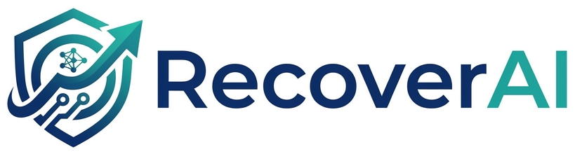
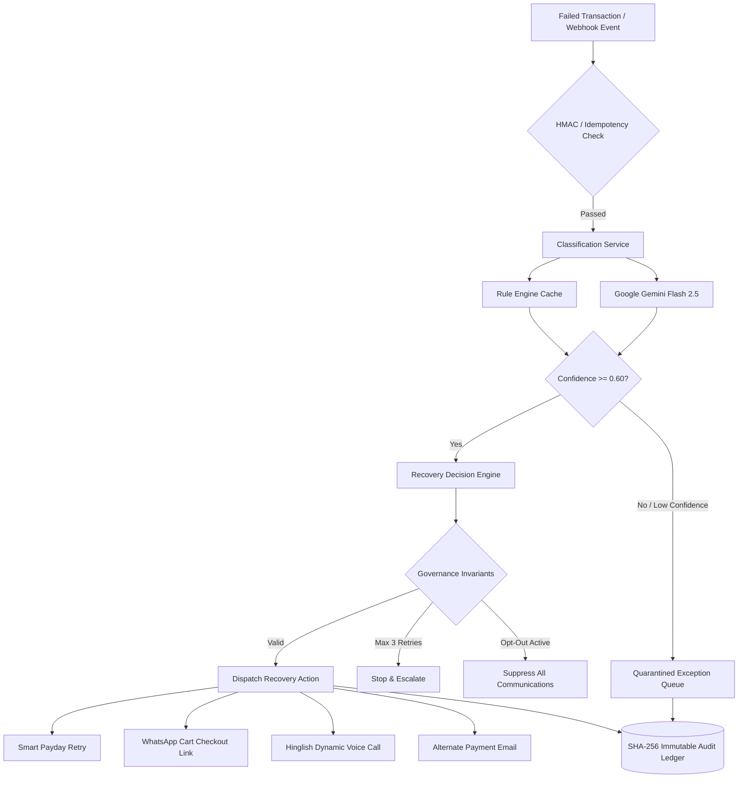

<p align="center">
  
</p>

<p align="center">
  <strong>Autonomous AI Revenue Recovery Engine & Bounded Financial Intervention Platform</strong>
</p>

<p align="center">
  <a href="https://recoverai-backend-uoo0.onrender.com/health"></a>
  
  
  
</p>

---

## 🚀 Live Deployments

- **Backend API (Render):** [`https://recoverai-backend-uoo0.onrender.com`](https://recoverai-backend-uoo0.onrender.com)
- **API Health Probe:** [`https://recoverai-backend-uoo0.onrender.com/health`](https://recoverai-backend-uoo0.onrender.com/health)
- **API Root Info:** [`https://recoverai-backend-uoo0.onrender.com/`](https://recoverai-backend-uoo0.onrender.com/)

---

## 📌 Executive Summary

**RecoverAI** is an enterprise-grade autonomous revenue recovery system designed for high-scale merchants, fintechs, and subscription platforms. When digital payments fail or checkout journeys break, RecoverAI intercepts the failure, diagnoses root causes via Google Gemini AI and deterministic rule engines, dispatches compliance-bounded recovery actions (SMS, WhatsApp checkout triggers, Smart Retries, Hinglish Voice Calls), and records an immutable cryptographic audit ledger.

### 4 Multi-Channel Revenue Streams Rescued
1. ⚡ **Payment Gateway Drops:** Diagnoses `BANK_TIMEOUT`, `CARD_EXPIRED`, `INSUFFICIENT_FUNDS` with automated retries and alternate payment prompts.
2. 🛒 **Cart & Checkout Abandonment:** Rescues `CHECKOUT_HESITATION` and `OTP_DROPOFF` via personalized WhatsApp checkout links.
3. 🔁 **Recurring Subscription Mandates:** Handles `MANDATE_EXPIRED`, `NACH_REVOKED`, and smart payday-aligned renewal retries.
4. 📄 **B2B Receivables & Invoices:** Manages 30d/60d overdue dunning schedules with Promise-to-Pay (PTP) commitments and AI voice follow-ups.

---

## ⚡ Quick Start (< 2 Minutes)

### Prerequisites
- **Node.js** (v18.0 or higher)
- **MongoDB** (Local instance or free [MongoDB Atlas](https://www.mongodb.com/cloud/atlas) cluster)
- **Google Gemini API Key** (Free from [Google AI Studio](https://aistudio.google.com/app/apikey))

### 1. Clone & Install Dependencies

```bash
git clone https://github.com/Pravu772/RecoverAI.git
cd RecoverAI/recoverai

# Install backend dependencies
cd backend
npm install

# Install frontend dependencies
cd ../frontend
npm install
```

### 2. Configure Backend Environment

Copy the `.env.example` template into `backend/.env`:

```bash
cd ../backend
cp .env.example .env
```

Edit `backend/.env` with your values:
```env
# MongoDB Connection String
MONGO_URI=mongodb+srv://<user>:<password>@cluster0.xxxxx.mongodb.net/paybackai

# Google Gemini API Key
GEMINI_API_KEY=your_gemini_api_key_here

# Server Port & Mode
PORT=5000
NODE_ENV=development

# Security Secrets (Dev tokens work out-of-the-box)
GATEWAY_WEBHOOK_SECRET=whsec_recoverai_dev_change_in_prod_2026
INTERNAL_API_TOKEN=dev_token_recoverai_2026_change_in_prod
FRONTEND_ORIGIN=http://localhost:5173
```

### 3. Run Locally (Two Terminals)

**Terminal 1 — Backend:**
```bash
cd backend
npm start
# -> Backend running on http://localhost:5000 [development]
```

**Terminal 2 — Frontend:**
```bash
cd frontend
npm run dev
# -> Local Vite server running on http://localhost:5173
```

Open **`http://localhost:5173`** in your browser.

---

## 🎮 Interactive Demo Walkthrough (30 Seconds)

1. **Cold Load & Loading Animation:** Watch the fintech-grade ambient cash flow lines resolve into the RecoverAI focal mark.
2. **Run Autonomous Recovery Cycle:** Click **"Run Full Recovery Cycle"** in the top hero card. 50 synthetic risk transactions are generated, classified with Gemini AI, and recovered in real time.
3. **Interactive Ledger:** Click any row in the **Transactions Ledger** to slide open the **Audit Trail Drawer**.
4. **Hinglish AI Voice Agent Simulation:** In the drawer, navigate to the **Voice AI** tab and click **"Play Interactive Dialogue"** to hear the conversational Hindi/English debt negotiation script.
5. **Promise-to-Pay (PTP):** Record a PTP commitment with custom date and notes; verify real-time status update in the ledger.
6. **Resilience & Chaos Drill:** Click **"Outage Drill"** in the header to simulate a live Gemini 503 outage and observe the self-healing circuit breaker fallback to deterministic heuristics with zero data loss.
7. **CFO Revenue Digest:** Open **Governance** → **CFO Revenue Digest** in the sidebar to review unit economics, net yield multipliers, and multi-tenant workspace benchmarks (Swiggy, Zomato, Flipkart, Freshworks).

---

## 🏛️ System Architecture



---

## 🛡️ Enterprise Security & Hardening

RecoverAI includes enterprise-grade guardrails for production compliance:

| Security Feature | Implementation | Purpose |
|---|---|---|
| **API Authentication** | Bearer Token (`INTERNAL_API_TOKEN`) on all mutating & read routes | Prevents unauthorized data access |
| **Webhook Verification** | HMAC-SHA256 signature verification via `X-Gateway-Signature` | Prevents forged payment.captured events |
| **HTTP Security Headers** | `helmet` (CSP, HSTS, X-Frame-Options, X-Content-Type-Options) | Prevents clickjacking and MIME sniffing |
| **Audit Immutability** | Cryptographic SHA-256 parent-child hash chaining on all audit events | Verifiable provenance for regulatory audits |
| **PII Data Masking** | `maskName()` and `maskAmount()` redaction on standard console logs | DPDP Act / GDPR compliance |
| **Circuit Breaker** | Auto-trips to deterministic fallback on upstream AI outage | 99.99% availability under 3rd-party downtime |
| **DoS & Rate Limiting** | `express-rate-limit` + 1MB JSON body size limit + 50 SSE client cap | Protects event loop and server memory |

---

## 🌐 Production Cloud Deployment

### Backend on [Render.com](https://render.com)
1. Create a new **Web Service** pointing to your repository.
2. Set **Root Directory:** `recoverai/backend`
3. Set **Build Command:** `npm install`
4. Set **Start Command:** `node server.js`
5. Configure Environment Variables:
   - `NODE_ENV` = `production`
   - `PORT` = `10000`
   - `MONGO_URI` = `mongodb+srv://...`
   - `GEMINI_API_KEY` = `your-gemini-key`
   - `GATEWAY_WEBHOOK_SECRET` = `your-webhook-secret`
   - `INTERNAL_API_TOKEN` = `your-secure-internal-token`
   - `FRONTEND_ORIGIN` = `https://*.vercel.app,https://your-domain.com`

### Frontend on [Vercel.com](https://vercel.com)
1. Create a new **Project** from your repository.
2. Set **Root Directory:** `recoverai/frontend`
3. Set **Framework Preset:** `Vite`
4. Add Environment Variables:
   - `VITE_API_BASE_URL` = `https://recoverai-backend-uoo0.onrender.com/api`
   - `VITE_API_TOKEN` = `your-secure-internal-token`
5. Click **Deploy**. *(Includes `vercel.json` for SPA rewrites)*.

---

## 📡 REST API Reference

| Method | Endpoint | Description | Auth Required |
|---|---|---|---|
| `GET` | `/` | Service information & root status | No |
| `GET` | `/health` | Liveness & healthcheck probe | No |
| `POST` | `/api/transactions/generate` | Generate batch of synthetic transactions (`count`, `confirm`) | Yes |
| `POST` | `/api/transactions/classify-batch` | Classify all failed transactions using AI & heuristics | Yes |
| `POST` | `/api/transactions/:id/classify` | Classify a single transaction by ID | Yes |
| `POST` | `/api/transactions/recover-batch` | Execute bounded recovery actions across classified items | Yes |
| `POST` | `/api/transactions/:id/recover` | Execute recovery on a single transaction | Yes |
| `GET` | `/api/transactions` | Query ledger transactions (`stream`, `status`, `limit`) | Yes |
| `POST` | `/api/transactions/:id/voice-script` | Generate/fetch dynamic Hinglish debt recovery voice script | Yes |
| `POST` | `/api/transactions/:id/ptp` | Record a Promise-to-Pay commitment (`ptp_date`, `ptp_notes`) | Yes |
| `GET` | `/api/audit/:transaction_id` | Retrieve immutable audit timeline for a transaction | Yes |
| `GET` | `/api/dashboard/summary` | Aggregate revenue yield, recovered capital, and breakdown | Yes |
| `GET` | `/api/dashboard/batch-report` | Full batch test report and baseline benchmark statistics | Yes |
| `POST` | `/api/simulate/inject-failure` | Inject chaos failure scenarios (`gemini_api_down`) | Yes |
| `POST` | `/api/simulate/advance-time` | Fast-forward simulated clock by N days | Yes |
| `GET` | `/api/stream/events` | Real-time Server-Sent Events (SSE) live pipeline stream | No |
| `POST` | `/api/webhooks/gateway` | Ingest external payment gateway webhooks (HMAC verified) | HMAC |

---

## 🧪 Automated Feature Verification Suite

To run the automated verification test suite covering audit integrity, circuit breakers, PTP state transitions, and rate limiting:

```bash
cd recoverai/backend
node test/verify_features.js
```

---

## 📁 Repository Structure

```text
RecoverAI/
├── recoverai/
│   ├── backend/
│   │   ├── src/
│   │   │   ├── config/          # MongoDB & Google Gemini AI clients
│   │   │   ├── controllers/     # Request handlers & batch orchestrators
│   │   │   ├── middleware/      # Correlation ID, Idempotency & Auth
│   │   │   ├── models/          # Transaction & AuditLog Mongoose schemas
│   │   │   ├── routes/          # Express API route modules
│   │   │   ├── services/        # Classification, Recovery Decision & Audit services
│   │   │   └── utils/           # Data generator, PII sanitizer & SSE broadcaster
│   │   ├── server.js            # Main Express application entry point
│   │   └── .env.example         # Environment variables template
│   ├── frontend/
│   │   ├── src/
│   │   │   ├── api/             # Axios client with token auth & normalizers
│   │   │   ├── components/      # UI components (Ledger, Drawer, Cards, Modals)
│   │   │   ├── context/         # Currency & Loading state contexts
│   │   │   ├── pages/           # Main Dashboard workspace
│   │   │   └── index.css        # Design tokens & loading keyframes
│   │   ├── vercel.json          # Vercel SPA routing configuration
│   │   └── vite.config.js       # Vite bundler configuration
│   └── render.yaml              # Render blueprint deployment file
└── README.md
```

---

## 📜 License & Compliance

Built for fintech evaluation and high-volume merchant revenue recovery. Designed with strict data privacy (DPDP/GDPR compliant PII redaction) and bounded financial automation guardrails.
